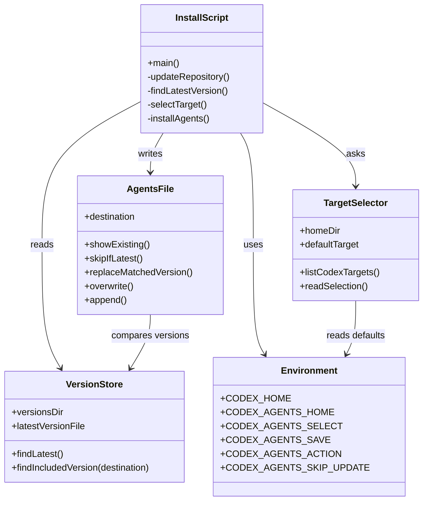

# Class Diagram

This repository is a shell-script installer, so the diagram describes the main responsibilities as modules rather than language-level classes.

## Responsibilities

- `InstallScript`: Coordinates the full install flow in `install.sh`.
- `VersionStore`: Finds numbered Markdown files under `versions/` and chooses the highest number as the latest version.
- `TargetSelector`: Lists `~/.codex*` directories, marks the default target, and resolves the user's selection.
- `AgentsFile`: Handles existing `AGENTS.md` content, including skip, version replacement, overwrite, and append.
- `Environment`: Provides non-interactive controls for tests and custom install locations.
